# Vault Siege: Architecture Report

## Executive summary

This repository is a small, intentionally gamified distributed application built from two main parts:

- a React/Vite frontend that renders a multi-stage “puzzle” experience
- an Express backend that tracks a global system state and validates puzzle submissions

The application is not a production-grade service. It is a single-node puzzle engine designed to simulate a layered challenge with game-like progression. The architectural pattern is straightforward: the server owns the state machine, the client polls it, and each puzzle step advances the current layer when the correct answer is submitted or when a non-standard condition is met.

The notable fact is that the runtime is heavily shaped by game logic rather than secure software design. The project exposes public endpoints, keeps global state in memory and on disk, and intentionally contains a forced final-state override. In other words, it is an architectural demo of a stateful, server-driven flow rather than a hardened platform.

---

## High-level system view

The project is composed of the following primary elements:

- `server/index.js` — the domain controller, progression logic, global state, route definitions, and challenge orchestration
- `server/puzzles/` — puzzle validators for each layer
- `server/config.js` — configuration object used in the “GitHub override” challenge
- `server/game-state.json` — persisted active-layer index
- `client/src/App.jsx` — top-level React state controller and layer switcher
- `client/src/components/` — UI screens for each era/layer
- `client/public/puzzle.c` — artifact for the hash puzzle
- `server/secure-assets/Go Ahead Open This.bat` — final reward artifact, protected behind the final unlocked state

A simplified runtime flow looks like this:

```mermaid
flowchart LR
    A[Client loads App] --> B[GET /api/v1/system-state]
    B --> C[Server returns current layer + token]
    C --> D[Render active view]
    D --> E[User submits answer]
    E --> F[POST /api/v1/bypass-layer]
    F --> G[Validate answer + HMAC token]
    G --> H[Advance activeLayerIndex]
    H --> I[Persist state to game-state.json]
    I --> J[Client polls again and renders next stage]
```



---

## Runtime architecture

### 1. Frontend composition

The frontend is a React application built with Vite. The root application in `client/src/App.jsx` maintains three key pieces of state:

- `themeState`: the current layer/theme string
- `metrics`: siege-related connection counters for the final phase
- `submissionToken`: a short-lived token generated by the server for proof-of-submission and anti-replay checks

`App.jsx` uses a polling loop every 2000ms to call `/api/v1/system-state`. This allows the UI to update as the server advances the game. Each active layer renders a component: `MechanicalView`, `HashView`, `BookView`, `MorseView`, `OpenSourceView`, and `CloudSiegeView`.

The UI is intentionally themed and fully text-driven. It is designed like a narrative terminal interface, not a standard web app. Most view components use a nearly identical pattern:

1. render a themed “quest” panel
2. collect user input
3. POST the solution to `/api/v1/bypass-layer`
4. if successful, call `onBreach()` to refresh state from the server

This pattern is repeated across the first five layers. It is simple, consistent, and easy to extend, but it also creates a highly uniform client contract that assumes the backend is always correct.

### 2. Backend composition

The server is a single Express app created in `server/index.js`. It performs the following jobs:

- exposes the system-state API
- validates puzzle submissions
- maintains the global progression index
- tracks user participation in the siege phase
- reads live config values for the GitHub challenge
- issues protected downloads for the final reward
- provides a message broadcast endpoint for the architect

The central state is a `systemLayers` array:

```js
const systemLayers = [
  { id: "punchcards", theme: "ERA_MECHANICAL" },
  { id: "hash", theme: "ERA_HASH" },
  { id: "book", theme: "ERA_ARCHIVE" },
  { id: "morse", theme: "ERA_MORSE" },
  { id: "github", theme: "ERA_OPEN_SOURCE" },
  { id: "siege", theme: "ERA_CLOUD_SIEGE" },
  { id: "unlocked", theme: "SYSTEM_ACCESSED" }
];
```

The active progression index is stored in `server/game-state.json` and loaded at boot. The server advances this index as players complete each layer.

### 3. Persistence and state model

The game uses a file-backed state value:

- `loadState()` reads `game-state.json`
- `saveState()` writes the new index back to disk
- `activeLayerIndex` is the single source of truth for progression

This makes the system globally shared across all clients and gives the project a crude “distributed shared state” feel. Any node hitting the server sees the same active layer. There is no session per user, no database, and no authentication layer. The entire experience is global and public.

---

## Puzzle flow and data flow

### Layer 1: Punchcards

The server resolves a validator by layer ID from `server/puzzles/puzzleRegistry.js`.

For the punchcard layer, the validator expects a string matching the default value:

- `D:\Nothing\.git\config`

The file reads a normalized submission value and compares it to the expected string. The server does not manage any complex logic here; it simply validates a plaintext answer.

### Layer 2: Hash challenge

This challenge gives the client a `puzzle.c` artifact and expects the hash output of a custom seed. The validator strips whitespace and uppercases the answer before comparing it to the expected hash string.

The artifact itself is a standard C program that applies a 64-bit FNV-like hash with a loop of 50 million iterations. This is a classic “perform calculation locally” pattern intended to mimic a challenge designed to make the player do work on their machine.

### Layer 3: Book / archive challenge

The validator expects an IPv4 address string:

- `10.50.80.5`

The narrative text says the player must find fragments across class members, but the actual backend is still a simple string comparison. This demonstrates a split between thematic storytelling and an implementation that is technically a trivial gate.

### Layer 4: Morse / hardware interception

The validator expects:

- `NCC`

Again, the actual implementation is a shallow equality check. The “external hardware” presentation is mostly atmospheric.

### Layer 5: GitHub / architecture override

The GitHub layer is a deliberate twist: it does not permit direct bypass (`/api/v1/bypass-layer` refuses GitHub submissions). Instead, the server polls `server/config.js` and checks for two values:

- `ATTACK_MODE_ENABLED === true`
- `MAX_RATE_LIMIT >= 200`

When both are satisfied, a background interval advances the system automatically.

This is the clearest example of server-side system automation in the repository. The player is meant to edit config and then let the server notice the modified live configuration.

### Layer 6: Cloud siege

The final challenge uses a global heartbeat model:

- each client sends POST requests to `/api/v1/siege-ping` with its own `clientId` every 2 seconds
- the server records that client in `activeUsers`
- it also tracks `ipClientMap` to limit one client ID per IP
- a background timer counts active users and compares them to `targetThreshold`, which defaults to 275

When active connections reach the threshold, the server increments `activeLayerIndex` to the next state, effectively unlocking the system.

This is a distributed “collective coordination” challenge, but it is still implemented using naive, in-memory counting rather than a real distributed coordination system.

### Final unlock and reward

Once `activeLayerIndex >= 6`, the `/api/v1/claim-reward` route becomes available and sends the protected file `secure-assets/Go Ahead Open This.bat` to the client. The reward is gated behind a final state check rather than identity or authorization.

---

## Security and trust model

### HMAC token design

The server signs a per-layer submission token with HMAC-SHA256:

- token payload: `${layerId}:${timestamp}`
- signature: HMAC with `TOKEN_SECRET`
- TTL: 30 seconds

This prevents stale tokens from being replayed and ties the token to the current layer. In principle, this is a sensible anti-replay pattern. In practice, it is only effective as a lightweight control; it does not provide real authentication because any client can ask the backend for a valid token and then submit it.

### Environmental configuration and challenge logic

The challenge intentionally relies on the repository configuration file:

```js
module.exports = {
  MAX_RATE_LIMIT: 275,
  ATTACK_MODE_ENABLED: true,
};
```

This is a significant design weakness because the challenge is effectively trivialized by the repository itself. The file comments explicitly tell the reader to change values and the config is loaded live via `require()` and cache busting. This means the “override” is mostly a file-edit exercise, not a strong security boundary.

### Public-state behavior

Every system endpoint is public. There is no user account, no session token, no identity verification, and no permission model. This is not a security product; it is a global progression game. The server doesn’t know who is playing or whether the request came from a legitimate actor.

---

## Architectural problems and design risks

### 1. Forced final-state override

This is the single most critical issue in the repository.

The server contains this code:

```js
let activeLayerIndex = loadState();

//Go back

// Change this to go back to the first layer
activeLayerIndex = 6;
```

This line forcibly sets the system to the final unlocked state. In other words, the game is effectively always complete after startup. This eliminates the intended progression model and turns the entire architecture into a demonstration of a forced bypass, not a real challenge flow.

### 2. State is globally mutable and easy to spoof

Because state is stored in a plain JSON file and world state is shared across all clients, any party with file access can alter progression. This is a fundamental issue for a system that is supposed to maintain integrity.

### 3. Random token secret resets every boot

The backend generates `TOKEN_SECRET` as:

```js
process.env.TOKEN_SECRET || crypto.randomBytes(32).toString('hex')
```

This means the signing secret differs on every server restart. That is usually not a safe approach for long-lived stateful systems because it invalidates prior tokens and makes behavior non-deterministic across restarts. In a puzzle environment it is acceptable, but from an application architecture standpoint it is not a stable trust model.

### 4. Weak client identity model

The siege flow relies on a client-generated random ID:

```js
const generateClientId = () => Math.random().toString(36).substring(2, 15);
```

This is not a secure identifier. It is not even cryptographically random, and it is not tied to a real user or session. The backend cannot reliably distinguish legitimate users from spoofed clients.

### 5. IP-based anti-spoofing is crude and brittle

The server uses:

- `ipClientMap`
- `MAX_CLIENTS_PER_IP = 1`

This is a simplistic attempt to limit spoofing, but it is brittle in shared-network environments. Multiple users behind the same NAT or VPN will collide. It also does not provide meaningful identity verification.

### 6. Partial server-side control logic is inconsistent

The code mixes three different advancement mechanisms:

- direct answer validation via `/api/v1/bypass-layer`
- config polling auto-advancement for GitHub
- connection thresholds for the siege phase

This makes the state machine harder to reason about and weakens the consistency of the system. The design does not enforce a single canonical progression model.

### 7. Challenge-specific defaults weaken the abstraction

Some validation modules default to obvious values for puzzle answers. For example, the hash validator defaults to a hex string, and the config file itself defaults to an already-enabled mode. This creates a mismatch between the intended “secret” challenge and the actual implementation, because the answer is effectively discoverable in the codebase.

### 8. No production safety layer

No tests, no CI pipeline, no transaction model, no database, and no logging standards are implemented. The system has no formal verification for correctness. It is extremely easy to break by modifying a JSON file, editing config, or simply restarting the server.

---

## Data flow summary

The core data flow is remarkably simple and can be described as follows:

1. Client boots and requests the current system state.
2. Server responds with the active layer, the current theme, and a signed token for the active layer.
3. The client renders a challenge screen for that layer.
4. The user submits an answer.
5. The client posts the answer and token to the backend.
6. The backend validates the layer-specific puzzle and token, then advances the state.
7. The state is saved to `game-state.json`.
8. The client fetches again and updates the UI.

This model is appropriate for a local puzzle game, but it is not an architecture meant for real-world secure coordination.

---

## Operational notes

### Dependency profile

The project uses a modest stack:

- Node.js backend with Express
- Vite + React frontend
- basic Tailwind-based styling
- no database
- no test runner configured in the project files explicitly

### Typical startup flow

From the root of the project, the intended rough runtime is:

```bash
cd server
npm install
npm start
```

And in a separate terminal:

```bash
cd client
npm install
npm run dev
```

The client uses `VITE_API_URL` if provided; otherwise it assumes the backend is on `http://localhost:5000`.

### Notable runtime assumptions

- The backend is stateful in memory and on disk.
- The frontend depends on active polling to detect system changes.
- The system is global and shared across all connected clients.
- The project assumes a single-user or single-team local environment rather than a multi-user secure deployment.

---

## Architectural assessment

### What the project does well

- Clear separation between presentation and challenge logic
- consistent UI event flow across layers
- self-contained puzzle state machine
- short feedback loops with polling-based UI updates
- use of token-based anti-replay checks for direct submissions
- low complexity and easy comprehension for a small challenge app

### What it does poorly

- Global mutable state without identity or authorization
- hardened security assumptions are absent
- final progression can be forced via direct code modification
- no meaningful persistence beyond a plain JSON file
- challenge defaults are embedded in the codebase and not truly secret
- anti-spoofing logic is weak and unreliable
- the architecture is intentionally “game-like” rather than realistic for a production system

---

## Conclusion

Vault Siege is best understood as a deliberately theatrical engineering puzzle: a distributed-looking progression system implemented with a simple React front end and an Express back end. The architecture is easy to understand and easy to extend, which is a strength for a challenge app, but it is not robust enough for any security-sensitive or production-like use.

The most important design truth is that the application’s real architecture is not “a secure trial system” but “a state machine with narrative skin.” The server owns a single global layer index, the client blindly follows it, and the reality of progression depends heavily on a few simple conditions, some of which are intentionally overwritten or bypassed in the implementation itself.

From an engineering perspective, this repository demonstrates a valuable lesson: an apparently clever, narrative-driven state machine can still be built on fragile assumptions. The most critical flaws are not the puzzles themselves; they are the absence of proper identity, trust boundaries, and a consistent, enforceable global state model.

That is the core architectural story of the project: a challenge app with a strong theme, a shallow but effective state-flow model, and several obvious engineering shortcuts that make it more theatrical than secure.
